# PrivARcy — Frontend Guide

A visual walkthrough of every screen in the PrivARcy desktop app, in the
order you'd normally move through them: launch → choose a video or
camera → configure detection → process → review anything uncertain →
see results. Screenshots below are from the actual running app.

Unfamiliar term? Check the **[Glossary](#glossary)** at the end — every
technical word used in this guide (confidence threshold, IoU, liveness,
etc.) is defined there in plain language.

---

## Light Mode & Dark Mode

PrivARcy ships with both themes. The button in the top-right corner of
every page (labelled **"☀️ Light Mode"** or **"🌙 Dark Mode"**) always
shows the theme you'd switch *to* — click it to toggle. Your choice is
remembered the next time you open the app.

| Dark Mode (default) | Light Mode |
|---|---|
|  | 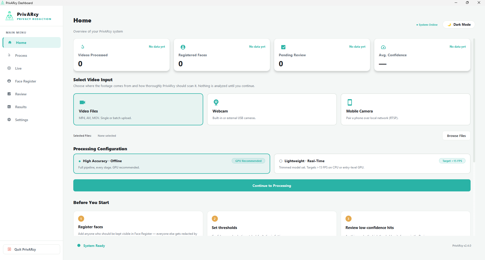 |

| Dark Mode | Light Mode |
|---|---|
| 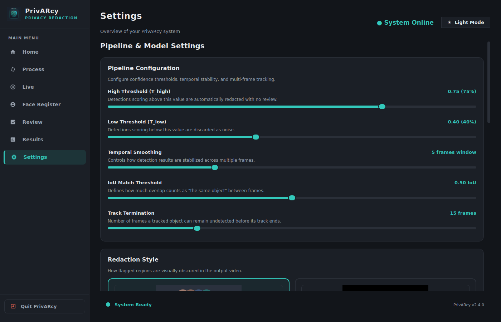 | 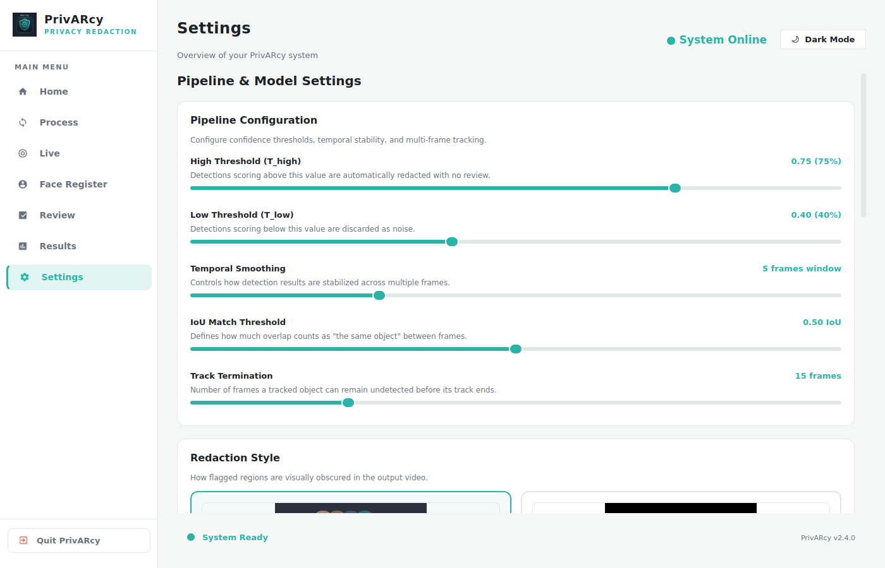 |

Every page, dialog, and card supports both themes — colors, icons, and
contrast all adjust together, not just the background.

---

## 1. Welcome Screen

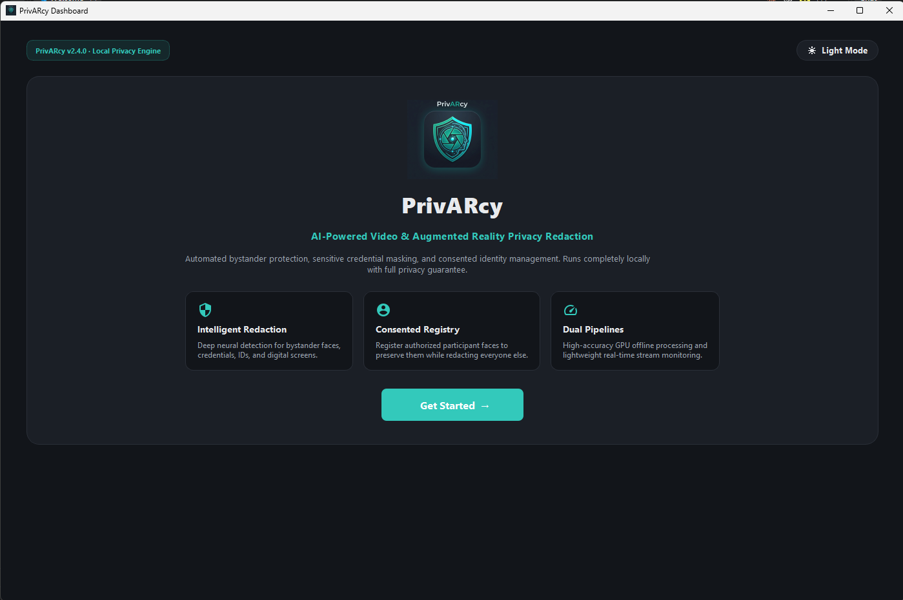

The screen you see on launch. It states what PrivARcy does in one line
— automated detection and redaction of faces, credentials, IDs, and
screens, running entirely on your own machine (no footage ever leaves
your computer) — and highlights the three pillars of the system:

- **Intelligent Redaction** — the detection models that find sensitive
  regions in a frame.
- **Consented Registry** — the face-registration system that tells
  PrivARcy who to *leave visible* (see section 5).
- **Dual Pipelines** — a high-accuracy offline mode for pre-recorded
  video, and a lightweight real-time mode for a live camera feed.

Click **Get Started** to enter the dashboard.

---

## 2. Home

Home is your starting point every time you open the app — a live
snapshot of the system plus a way to jump straight into processing.

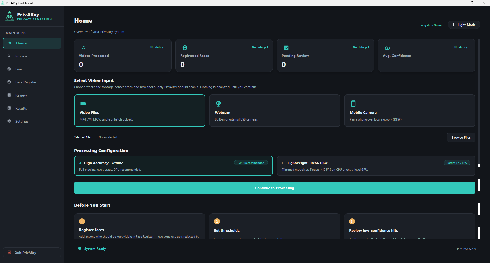

The four tiles at the top (**Videos Processed**, **Registered Faces**,
**Pending Review**, **Avg. Confidence**) are not static — they update
automatically as you use the app, reading straight from what's actually
happened in this session. They all read "No data yet" here because
nothing has been processed yet.

**Select Video Input** is where a job starts. Pick a source:
- **Video Files** — a pre-recorded MP4/AVI/MOV, single file or batch.
- **Webcam** — a built-in or USB camera.
- **Mobile Camera** — a phone paired over your local network.

Below that, **Processing Configuration** offers two profiles:
- **High Accuracy · Offline** — every stage of the pipeline runs on
  every frame. Slower, most thorough; a GPU is recommended.
- **Lightweight · Real-Time** — a trimmed model set aimed at 15+ FPS on
  CPU or an entry-level GPU, for live monitoring where speed matters
  more than catching absolutely everything.

Nothing is analyzed just by selecting a source — **Continue to
Processing** is what actually hands off to the Process page.

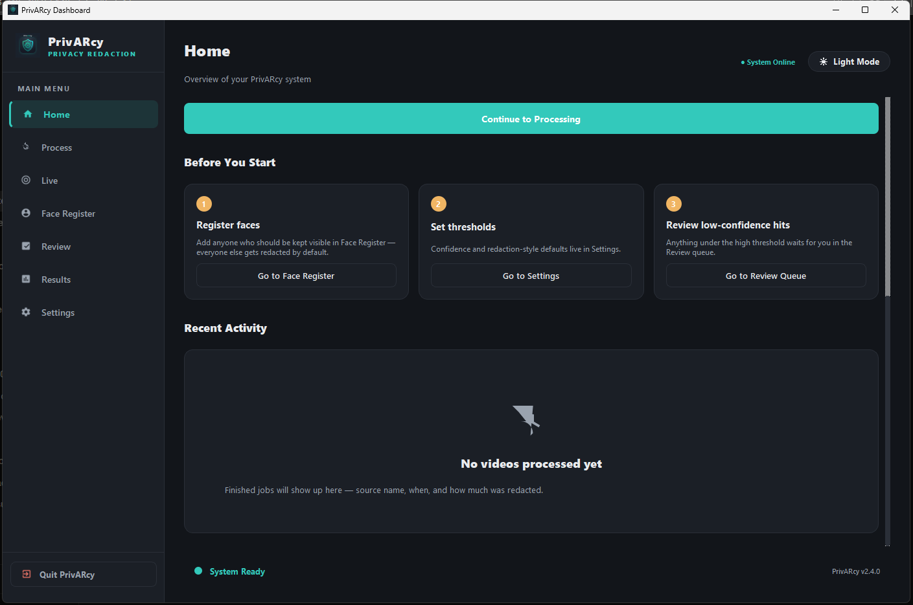

**Before You Start** is a 3-step checklist for first-time setup, each
with a direct shortcut button:
1. **Register faces** — add anyone who should stay visible; everyone
   else is redacted by default.
2. **Set thresholds** — the confidence cutoffs and redaction style live
   in Settings.
3. **Review low-confidence hits** — anything the system wasn't sure
   about waits for you in the Review queue.

**Recent Activity** is a running log of finished jobs — source name,
when it ran, and how much was redacted — so you can see your processing
history at a glance without digging through the Results page each time.

---

## 3. Process

This is where an actual video gets analyzed.

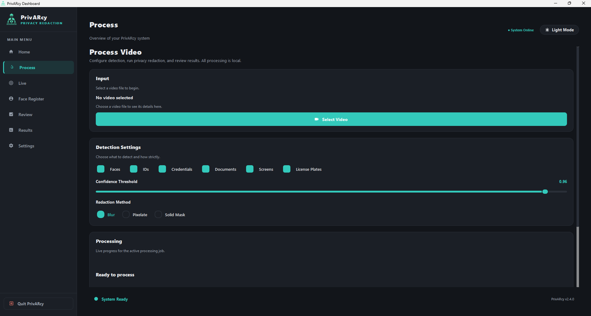

**Input**: pick a video file with **Select Video** (its details — name,
duration, resolution — appear here once chosen).

**Detection Settings** controls what PrivARcy looks for and how
strictly:
- The five checkboxes (**Faces, IDs, Credentials, Screens, License
  Plates**) turn detection categories on or off — an unchecked category
  is left completely untouched in the output.
- **Confidence Threshold** is the cutoff for automatic redaction — a
  detection scoring above this is redacted with no human review needed.
  (The full three-tier logic — auto-redact / send to Review / discard —
  is explained fully in Settings, section 8.)
- **Redaction Method** picks how a flagged region gets obscured:
  **Blur** (soft, scene still reads naturally) or **Solid Mask**
  (opaque black box, maximum certainty).

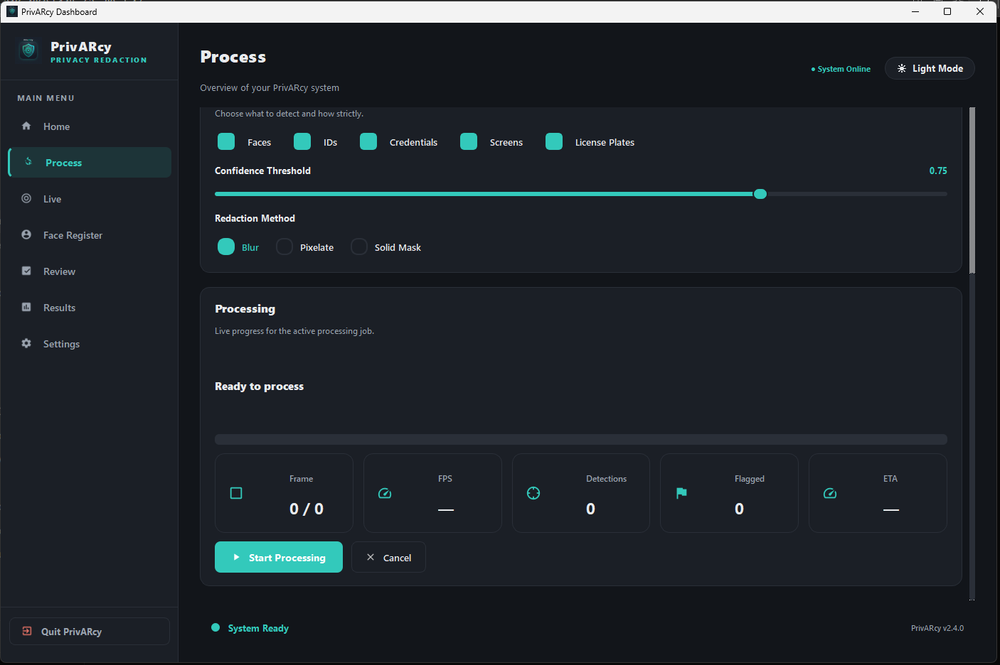

**Processing** shows live progress once you hit **Start Processing**:
current frame / total frames, live FPS, running detection and flagged
counts, and an ETA. **Cancel** stops a job partway through safely. When
it finishes, you're taken to Results automatically.

---

## 4. Live

For a live camera feed instead of a pre-recorded file — the same
detection → classification → redaction pipeline, running in real time.

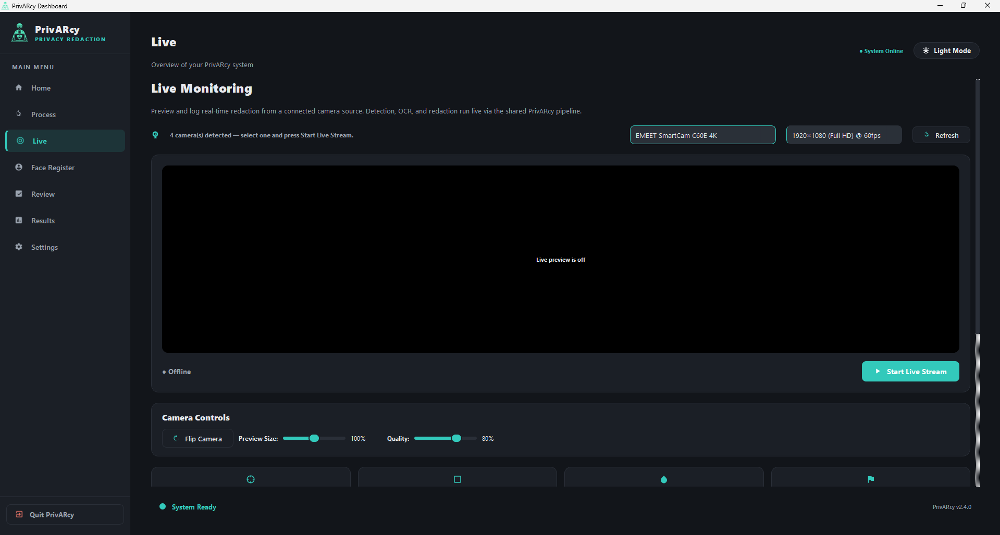

PrivARcy auto-detects connected cameras (shown here: 4 detected,
including a "EMEET SmartCam C60E 4K" by its actual device name — not a
generic "Camera 1"). Pick a camera and a resolution/frame-rate preset,
then **Start Live Stream**. The preview area shows **Offline** until
you do — nothing is captured or processed before that.

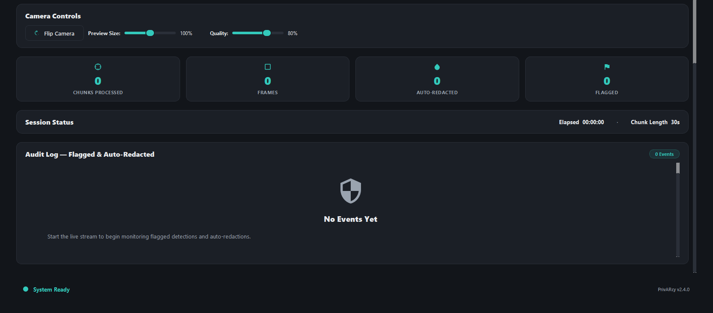

Once live, **Camera Controls** lets you flip the feed horizontally and
adjust preview size/quality on the fly. The four counters (**Chunks
Processed, Frames, Auto-Redacted, Flagged**) update continuously.

The **Audit Log** at the bottom is a real-time record of every
redaction and every item sent to review, timestamped as it happens —
useful for confirming the system is actually catching what you expect
during a live session, not just after the fact.

---

## 5. Face Register

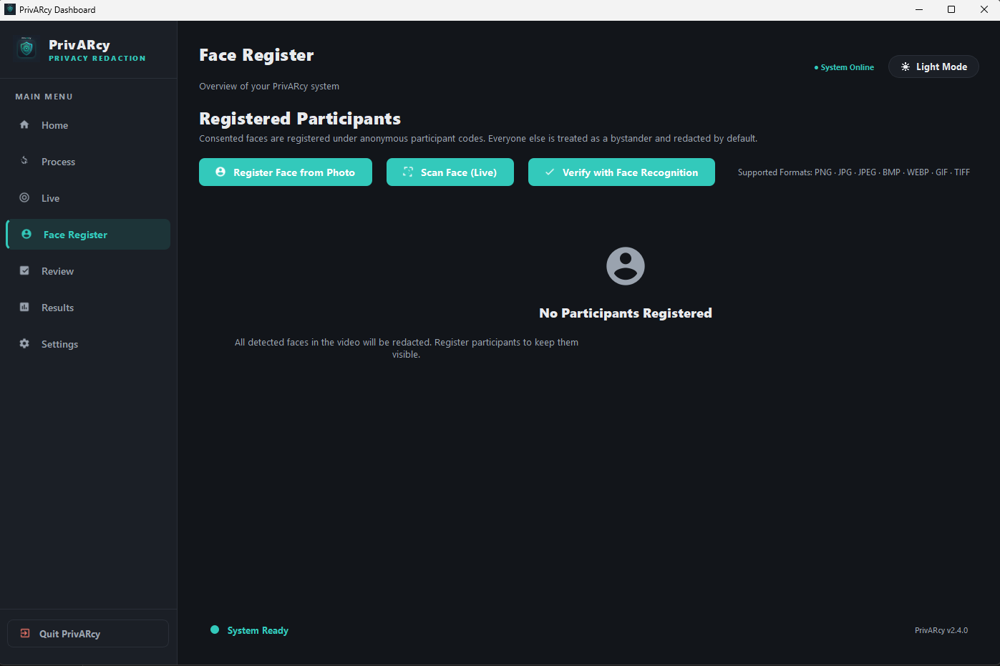

This is the "consented registry" mentioned on the Welcome screen: by
default, PrivARcy treats **every** face it detects as a bystander and
redacts it. Registering a face here — a participant, a host, yourself —
tells the system to recognize and *keep that person visible* instead,
while everyone else still gets redacted automatically.

Three ways to add someone:
- **Register Face from Photo** — upload a clear photo (PNG, JPG, and
  several other formats are supported).
- **Scan Face (Live)** — enroll directly from your webcam. This method
  requires you to actually **blink** during the scan before it'll
  capture — a basic liveness check, so a printed photo held up to the
  camera can't be used to register a face that was never really there.
- **Verify with Face Recognition** — re-checks a registered participant
  against their stored photo, confirming the registry entry is still
  intact.

Registered participants are stored under anonymous codes (e.g.
`P-001`), not by name displayed in the system elsewhere — the display
name here is just for your own reference.

---

## 6. Review

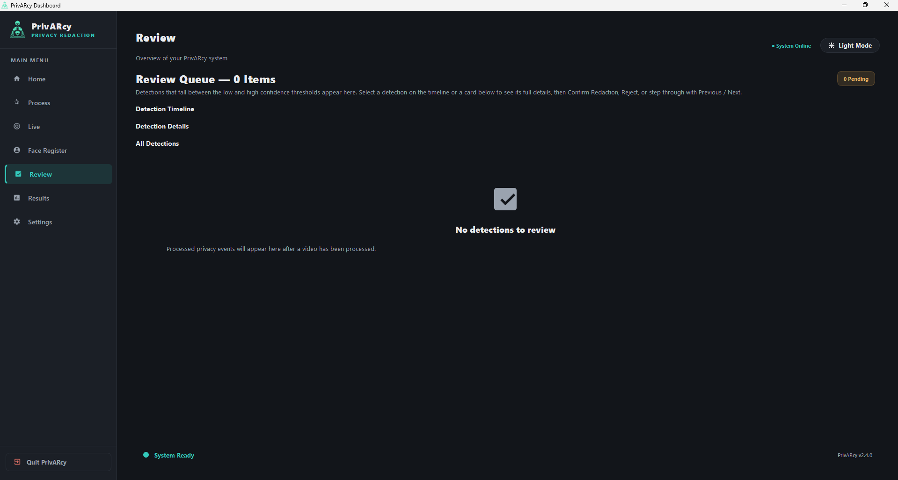

Not every detection is a clear yes/no. Anything that scores **between**
the low and high confidence thresholds (see Settings, section 8) lands
here instead of being auto-redacted or silently discarded — this is the
"confidence-gated human review" the whole system is built around.

For each item, you see it on the **Detection Timeline** (when in the
video it occurred) and in **Detection Details** (a close-up, the
category, and any text the system read off it), then choose:
- **Confirm Redaction** — yes, this should be blurred/masked. It also
  quietly helps the system learn: a confirmed item becomes a
  human-verified example the sensitivity classifier can be refined
  against later (see Settings → Correction Feedback), and — if it came
  from a category like an ID card or document — a labeled example for
  eventually retraining the detection model itself.
- **Reject** — no, this was a false alarm; it's left unredacted and also
  logged, so the system learns what it got wrong just as much as what
  it got right.

**Previous / Next** let you step through the whole queue without
returning to this list each time. The queue is empty here because no
video has produced any medium-confidence detections yet.

---

## 7. Results

Once a job finishes, this is where you see what happened and get your
output.

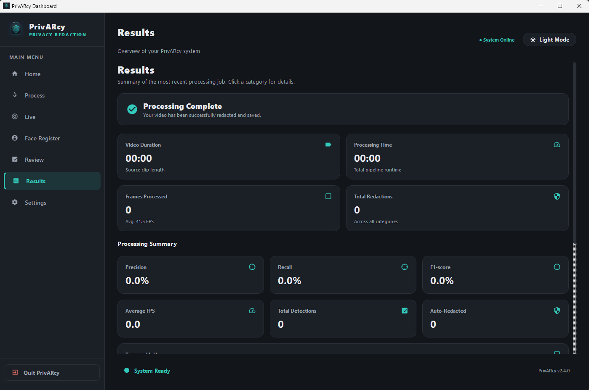

**Processing Complete** confirms the redacted video was saved. Below
it: **Video Duration**, **Processing Time**, **Frames Processed** (with
average FPS), and **Total Redactions** across every category combined.

**Processing Summary** gives you the pipeline's own quality metrics —
**Precision**, **Recall**, **F1-score** (how accurate the detections
were), **Average FPS**, **Total Detections**, and **Auto-Redacted**
count.

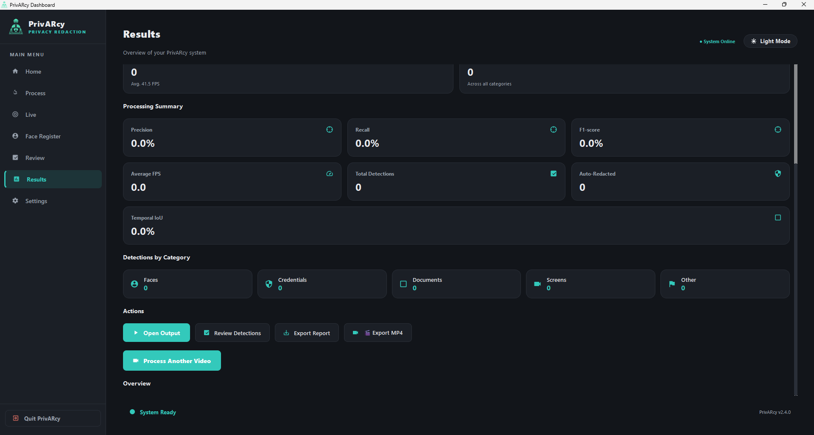

**Temporal IoU** measures how stable the redaction boxes stayed across
frames — this is the temporal-smoothing feature at work, keeping a
blurred region from visibly flickering frame to frame.

**Detections by Category** breaks the total down into Faces,
Credentials, Documents, Screens, and Other, each with its own count.

**Actions**:
- **Open Output** — plays the finished, redacted video file.
- **Review Detections** — jumps straight to the Review queue for this job.
- **Export Report** — saves a text/JSON summary of everything on this page.
- **Export MP4** — saves the redacted video wherever you choose.
- **Process Another Video** — clears this job's results and sends you
  back to Process for a new one.

---

## 8. Settings

Settings is split into focused sections; here's what each one actually
controls.

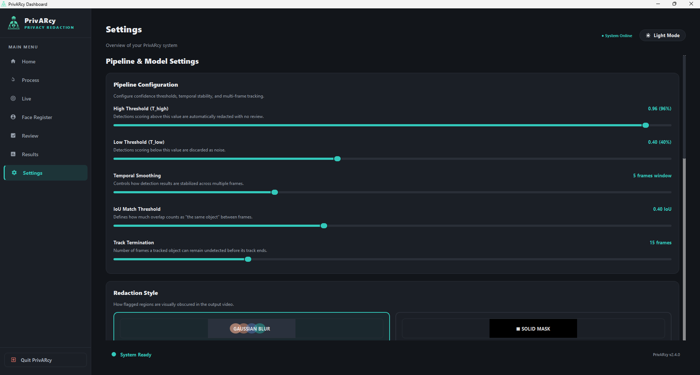

**Pipeline Configuration** is the heart of the confidence-gating logic:
- **High Threshold (T_high)** — score at or above this → **auto-redacted**,
  no human review.
- **Low Threshold (T_low)** — score below this → **discarded** as noise,
  not shown anywhere.
- Anything **in between** the two → sent to the **Review** queue for a
  human decision.
- **Temporal Smoothing** — how many recent frames get averaged together
  per tracked object before drawing its redaction box, so it doesn't
  visibly jitter.
- **IoU Match Threshold** / **Track Termination** — control how the
  system decides "this is the same object as last frame" and how long
  it keeps trying before giving up on a track that's gone off-screen.

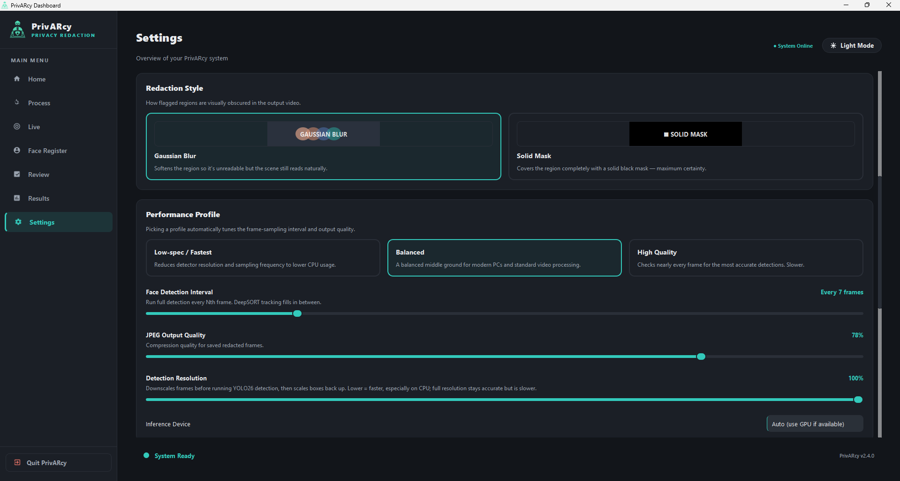

**Redaction Style** — Gaussian Blur (soft, natural-looking) vs. Solid
Mask (opaque, maximum certainty) — sets the default; Process.py can
still override it per job.

**Performance Profile** offers three presets (**Low-spec/Fastest**,
**Balanced**, **High Quality**) that automatically tune the sliders
below — a quick way to trade accuracy for speed without touching each
setting individually.

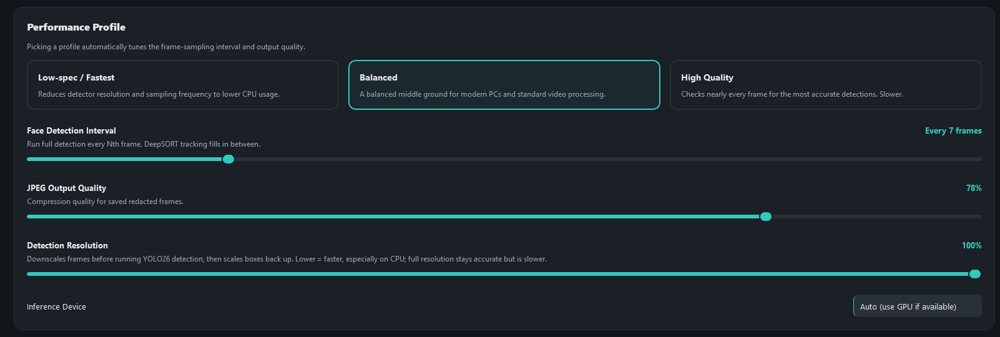

- **Face Detection Interval** — run full detection every Nth frame;
  tracking fills in the gaps between.
- **JPEG Output Quality** — compression level for saved frames.
- **Detection Resolution** — downscales frames before running YOLO26,
  then scales results back up; lower is faster (especially on CPU),
  full resolution stays most accurate but slower.
- **Inference Device** — Auto, CPU, or GPU (CUDA). Auto picks a GPU
  automatically if one's available.

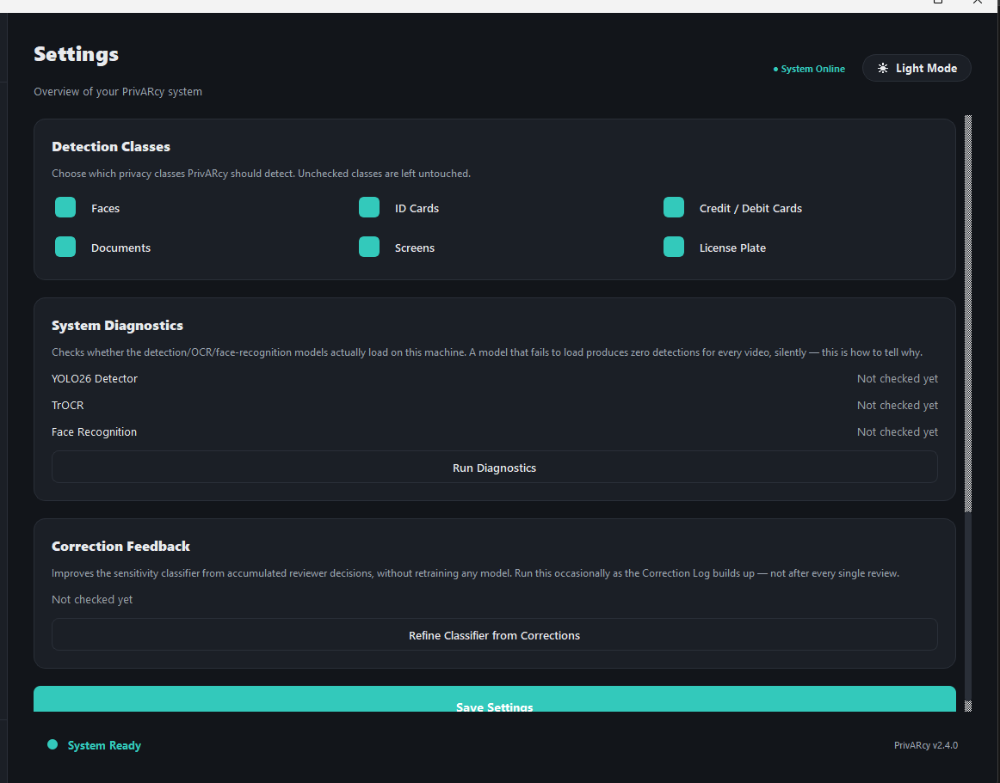

**Detection Classes** — the master on/off switch per category (Faces,
ID Cards, Credit/Debit Cards, Documents, Screens, License Plate). An
unchecked class here is never detected, anywhere in the app — this is
the same list as Process.py's checkboxes, just the persistent default.

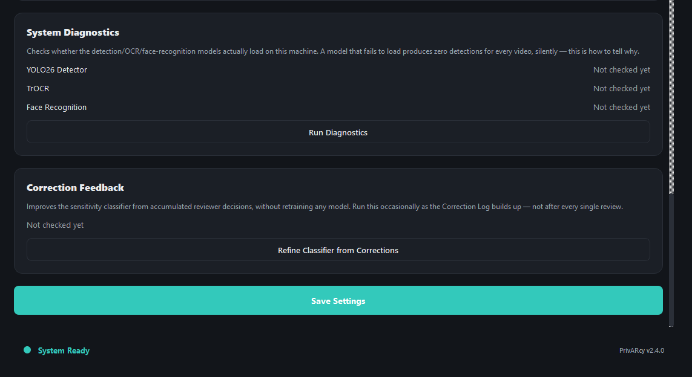

**System Diagnostics** answers a specific, important question: *is
each model actually working on this machine?* A model that fails to
load produces zero detections for every single video, completely
silently — this panel is how you'd catch that instead of wondering why
nothing ever gets flagged. Click **Run Diagnostics** to check the YOLO26
detector, TrOCR, and Face Recognition right now.

**Correction Feedback** is separate from the model diagnostics above —
it's how the system **improves over time** without retraining anything.
Every Confirm/Reject decision you make in Review is logged; clicking
**Refine Classifier from Corrections** periodically turns that
accumulated feedback into adjusted confidence weights for the
sensitivity rules, so patterns you keep rejecting matter less over
time and ones you keep confirming matter more.

**Save Settings** applies everything on this page immediately — including
to an already-running Live session, which restarts automatically in the
background to pick up the new values.
